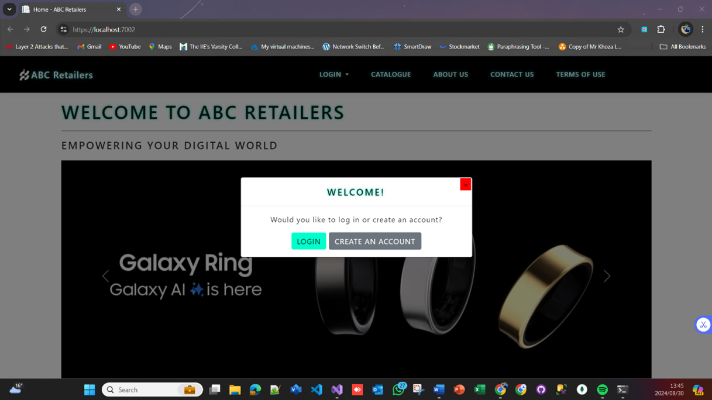
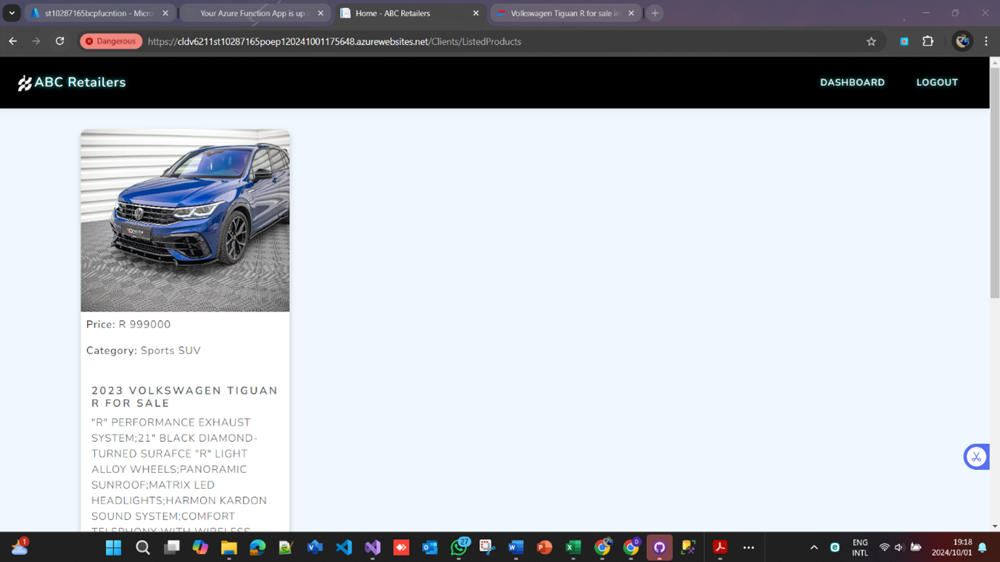
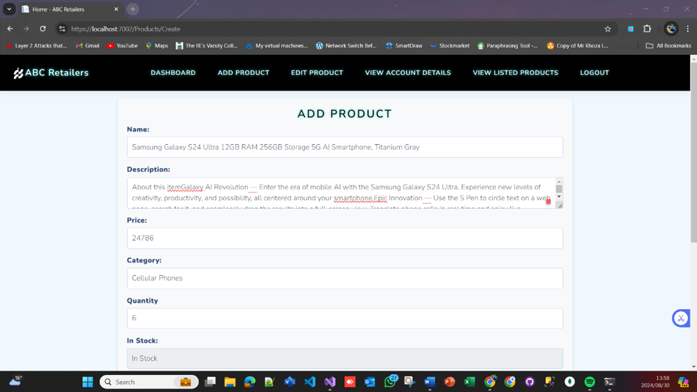
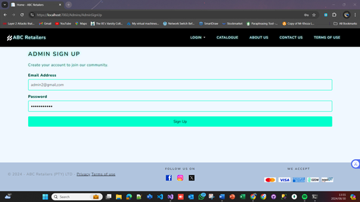
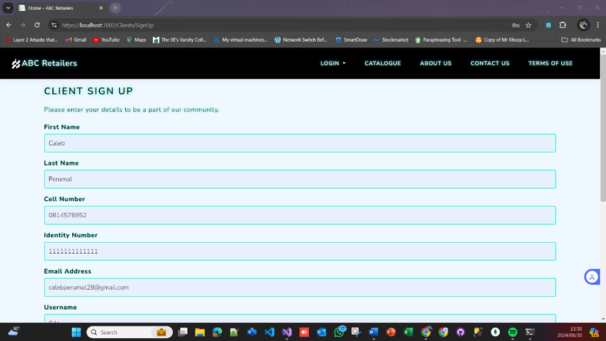
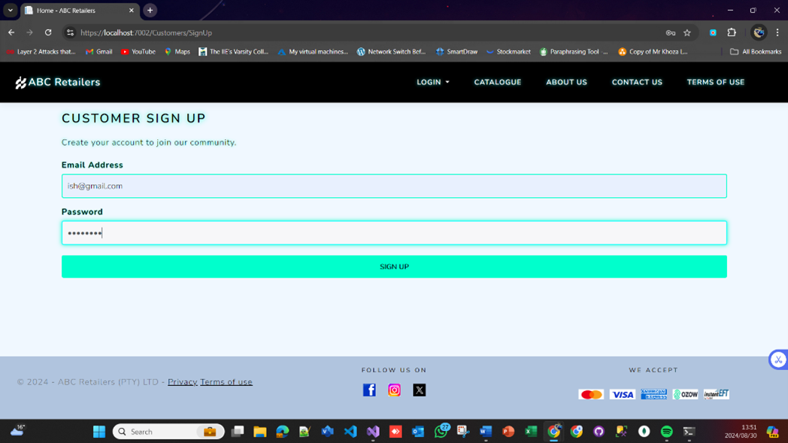
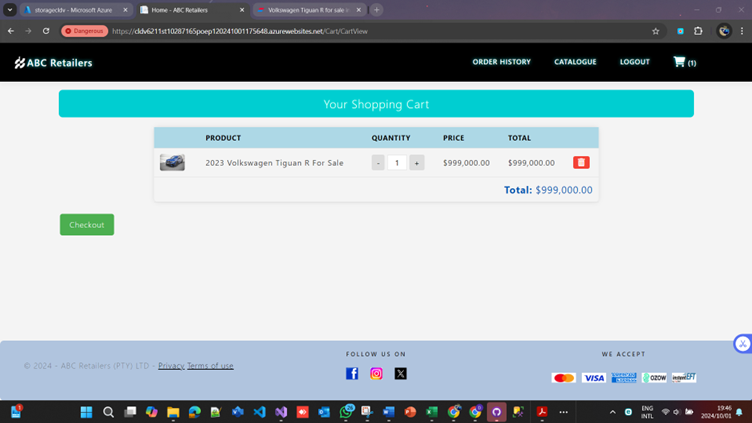
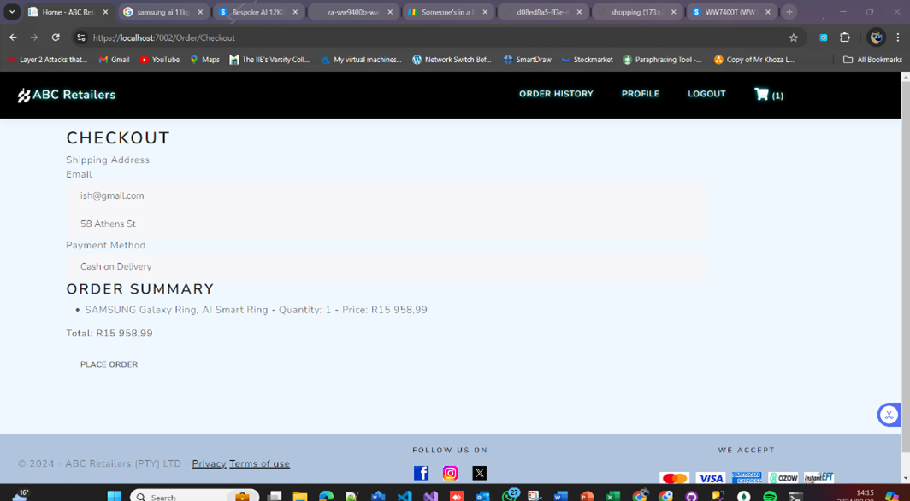
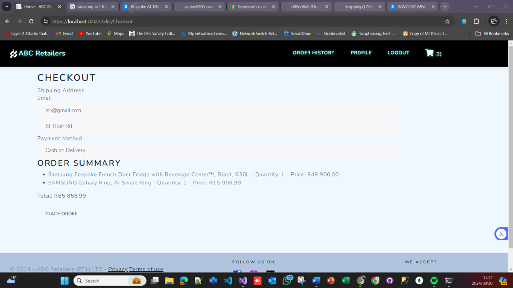
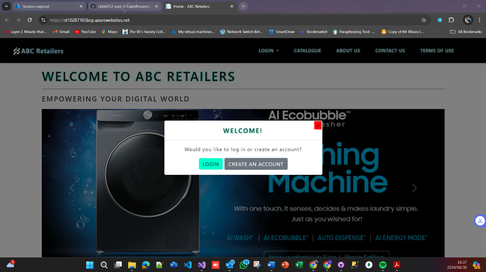

<div align="center">

<h1>🛍️💻 ABC Retailers – Part 1 Azure Storage 🛍️💻</h1>

<h2></h2>

</div>

---
**👤 Name:** Braden Caleb Perumal  
**🎓 Student Number:** ST10287165  

---

## 📑 Contents
- 📖 Introduction  
- ⚙️ Requirements  
- 📝 How to Apply  
- 🛍️ Application Overview  
- 🏗️ Architecture  
- 🚀 Functionality  
- 📊 Non-Functional Requirements  
- 🗂️ Change Log  
- ❓ FAQs  
- 🖥️ How to Use  
- 📜 Licensing  
- 🧩 Plugins  
- 🙌 Credits  
- 🌐 GitHub Link  
- 🎥 Screenshots
- 🔑 Admin Login Credentials  
- 📚 References  

---

## 1) Introduction
ABC Retailers – Part 1 is an **ASP.NET Core MVC** web application designed to manage **customer sign-ups, product listings, and order processing** in a secure and scalable environment.  
The system uses **role-based authentication** for Admins and Customers, provides **product CRUD** operations, and stores data in **SQL Server** using Entity Framework Core.  
The UI is **handcrafted** (no Bootstrap) for a unique brand experience.

---

## 2) Requirements
- .NET 6.0 SDK or higher  
- Microsoft SQL Server (Express or Full)  
- Visual Studio 2022  
- Entity Framework Core Tools  
- Git (version control)  

### Sample `appsettings.json` Configuration:
```json
{
  "ConnectionStrings": {
    "DefaultConnection": "Server=YOUR_SERVER;Database=ABCRetailersDb;Trusted_Connection=True;"
  },
  "Logging": {
    "LogLevel": {
      "Default": "Information",
      "Microsoft.AspNetCore": "Warning"
    }
  },
  "AllowedHosts": "*"
}
```

---

## 3) How to Apply
1. Clone this repository or download the ZIP.  
2. Open the project folder in **Visual Studio 2022**.  
3. Run `dotnet restore` to restore dependencies.  
4. Update the SQL connection string in `appsettings.json`.
5. > ⚠️ **Security Notice**  
> For security purposes, the `AzureStorage` connection string is **not** stored in this repository. You must configure it locally using one of the following methods:
> 
> 1. 📝 **Direct File Update (Legacy Approach)**  
>    Edit `appsettings.json` locally and insert your Azure Storage connection string in the `"AzureStorage"` field.  
>    *Important:* Do **not** commit this change to Git to avoid exposing sensitive credentials.
> 
> 2. 📂 **Environment Variables File (Recommended)**  
>    Create or update an `.env` file in the project root and add:  
>    ```env
>    ConnectionStrings__AzureStorage=YOUR_CONNECTION_STRING
>    ```
>    This keeps your credentials out of `appsettings.json` and Git while still being available at runtime.
> 
> 3. 🔐 **.NET User Secrets (Local Development)**  
>    Initialize and set the value using the .NET CLI:  
>    ```bash
>    dotnet user-secrets init
>    dotnet user-secrets set "ConnectionStrings:AzureStorage" "YOUR_CONNECTION_STRING"
>    ```
> 
> Replace `YOUR_CONNECTION_STRING` with your actual Azure Storage connection string. When using `.env` or user secrets, .NET will automatically override the value in `appsettings.json` at runtime.

6. Apply migrations:  
   ```bash
   dotnet ef database update
   ```
7. Run the application:  
   ```bash
   dotnet run
   ```

---

## 4) Application Overview
**Purpose:**  
To enable ABC Retailers to manage their customer base, maintain up-to-date product catalogs, and process orders efficiently through a web-based platform.

**Roles:**
- **Admin:** Manage products, view and manage customers, monitor transactions.  
- **Customer:** Register, browse products, and place orders.  

---

## 5) Architecture
ABC Retailers follows the **Model-View-Controller (MVC)** pattern:

- **Models:** Represent Products, Customers, and Orders.  
- **Views:** Razor pages for UI rendering.  
- **Controllers:** Manage request processing, validation, and data manipulation.  

**Data Storage:**  
- **SQL Server** for persistent storage.  
- **Entity Framework Core** for database operations.

---

## 6) Functionality

### Admin:
- Add, edit, delete products  
- View customer list and details  
- Manage orders  

### Customer:
- Register and update profile  
- View product catalog  
- Place and review orders  

---

## 7) Non-Functional Requirements
- **Security:** Role-based authentication; passwords hashed via ASP.NET Identity.  
- **Performance:** Optimized queries and minimal load times.  
- **Scalability:** Supports increased users and product listings without performance loss.  
- **Reliability:** Consistent availability and error handling.  
- **Usability:** Simple, clean UI for easy navigation.  

---

## 8) Change Log
**v1.0.0 – Initial Release**  
- ✅ Added role-based authentication  
- ✅ Implemented product CRUD  
- ✅ Added customer registration  
- ✅ Connected SQL Server with EF Core  
- ✅ Created custom UI without Bootstrap  

---

## 9) FAQs
**Q1:** Can I use these credentials in production?  
**A1:** ❌ No. These are only for testing; production uses seeded accounts.

**Q2:** Why not use Bootstrap?  
**A2:** The UI is handcrafted for a unique, brand-specific look.

**Q3:** How is security handled?  
**A3:** Authentication is role-based, and passwords are hashed via the ASP.NET Identity framework.

---

## 10) How to Use
1. Open **Visual Studio 2022** and navigate to the project folder.  
2. Run the following commands:  
   ```bash
   dotnet restore
   dotnet ef database update
   dotnet run
   ```
3. Open your browser and go to `http://localhost:5000`.

---

## 11) Licensing
ABC Retailers is licensed under the MIT License. You are free to use, modify, and distribute the project with proper credit.

---

## 12) Plugins
- Entity Framework Core  
- ASP.NET Identity  

---

## 13) Credits
This project was created and maintained by **Braden Caleb Perumal (ST10287165)**.

---

## 14) GitHub Link
https://github.com/YourUsername/abc-retailers-part1

---

## 15)  📸 Screenshots

### 🏠 Home Page & 🛍️ Product Catalog
<p align="center">
  <div align="center">
    <p><strong>🏠 Home Page</strong></p>
    
  </div>
  <div align="center">
    <p><strong>🛍️ Product Catalog</strong></p>
    
  </div>
</p>

### ➕ Add Product & 🛡️ Admin Sign-Up
<p align="center">
  <div align="center">
    <p><strong>➕ Add Product</strong></p>
    
  </div>
  <div align="center">
    <p><strong>🛡️ Admin Sign-Up</strong></p>
    
  </div>
</p>

### 👤 Client Sign-Up & 👤 Customer Sign-Up
<p align="center">
  <div align="center">
    <p><strong>👤 Client Sign-Up</strong></p>
    
  </div>
  <div align="center">
    <p><strong>👤 Customer Sign-Up</strong></p>
    
  </div>
</p>

### 🛒 Cart & 💳 Checkout
<p align="center">
  <div align="center">
    <p><strong>🛒 Shopping Cart</strong></p>
    
  </div>
  <div align="center">
    <p><strong>💳 Checkout</strong></p>
    
  </div>
</p>

### ✅ Order Confirmation & 📦 Order Details
<p align="center">
  <div align="center">
    <p><strong>✅ Order Confirmation</strong></p>
    
  </div>
  <div align="center">
    <p><strong>📦 Order Details</strong></p>
    
  </div>
</p>

### ☁️ Hosted Deployment View
<p align="center">
  <div align="center">
    <p><strong>☁️ Hosted Deployment View</strong></p>
    
  </div>
</p>


---

## 16) Admin Login Credentials
> ⚠️ **Note:** For demonstration purposes, the **Admin** can create an account and log in directly.  
> This is **not** a production practice — in a real deployment, accounts will be seeded and roles properly assigned.

---

## 17) References
- BroCode. C# Full Course. [YouTube](https://www.youtube.com/watch?v=wxznTygnRfQ)  
- BroCode. C# for Beginners. [YouTube](https://www.youtube.com/watch?v=r3CExhZgZV8)  
- Christensen, M. List of Lists in C#. [StackOverflow](https://stackoverflow.com/questions/12628222/creating-a-list-of-lists-in-c-sharp)  
- GeeksforGeeks. C# Constructors. [https://www.geeksforgeeks.org/c-sharp-constructors/](https://www.geeksforgeeks.org/c-sharp-constructors/)  
- Slayden, G. Convert Emoticons to UTF-32. [StackOverflow](https://stackoverflow.com/questions/44728740/how-to-convert-emoticons-to-its-utf-32-escaped-unicode)  
